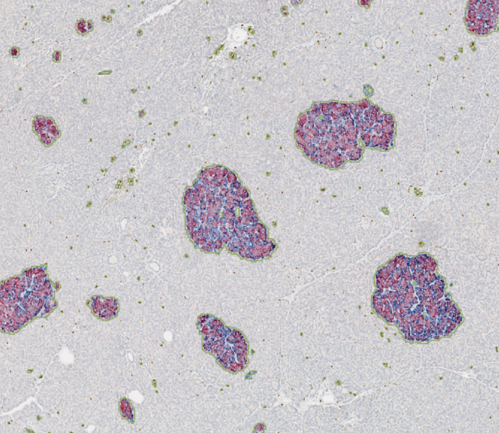

# [Islet segmentation Basic]

After creating a project in QuPath and uploading the images, we can start segmenting the islets.

1. Open one image

2. Using the rectangle tool, select the islets **[Press -> R]**

3. Continue choosing all the islets that will be run through the segmentation algorithm

4. After selecting all the islets, open the **SAM API** extension

5. Select all the annotations

6. Press **Run for Selected**
7. Wait for the segmentation to finish
8. Save the data

# Islet segmentation Advanced

1. Open one image
2. Go to **Classify** -> **Pixel classification** -> **Create Threshold**
3. create a new Threshold where the class is Islet and the 
   * Adjust properly the values where the majority of the islets are selected

4. Go through the image and remove non islet objects, create annotations for those islets using the previous method
5. Repeat steps 4-8 from the basic segmentation [this step will take time]

### As you can see, the output is not as good as the basic segmentation, but it is faster and can be used as a starting point for the basic segmentation